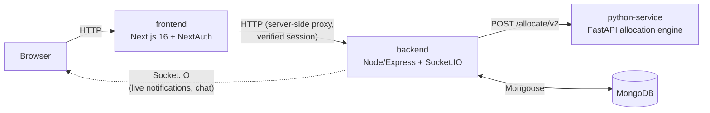

<p align="center"></p>

# RoomSync

**Multi-tenant hostel roommate allocation — matched by compatibility, never in violation
of the constraints that actually matter.**

[](https://github.com/Aditi22Bansal/PBL2/actions/workflows/ci.yml)

---

## What this is

RoomSync started as a BTech final-year project (a single-institution hostel allocation
tool) and has since been rebuilt into a real multi-tenant SaaS: any institution can
register its own organization, gated by its own email domain, and gets a fully isolated
dataset — students, room configurations, allocations, chat — with zero visibility into
any other institution's data. The core problem it solves hasn't changed: turn a pile of
student lifestyle/personality questionnaires into roommate groupings that are actually
compatible, without ever violating the constraints an institution can't compromise on
(no mixed-gender rooms, no smoking/non-smoking pairings) and without silently leaving
students unplaced.

## Key features

- **Multi-tenancy, for real.** Every collection is scoped by `organizationId`; a new
  institution registers itself (`/register`) with its own email domain and gets its own
  founding admin atomically. Verified: a brand-new org's dashboard is completely empty
  on first login — zero visibility into any other org's students, rooms, or configs.
- **Hard constraints as absolute pre-filters, not scored features.** Gender and
  smoking/drinking incompatibility are never something a high compatibility score can
  outweigh — they exclude a pairing outright before any matching runs. A two-phase
  engine (optimize, then guarantee) means the real 109-profile dataset places 100% of
  students today; the rare case a constraint genuinely can't be satisfied is reported
  explicitly (`needsManualPlacement`, with the specific blocking reason) rather than
  silently forcing a bad room or quietly dropping someone. See
  [docs/architecture.md](docs/architecture.md) for the full design.
- **Room-size and accessibility preferences.** Students can state a preferred room size
  or a ground-floor accessibility need; the engine honors it best-effort (using
  no-preference students as flexible filler) and always falls through gracefully to
  normal placement if it can't — a stated preference never blocks anyone from getting a
  room.
- **Real-time notifications.** A student sees their allocation the moment it happens
  (Socket.IO, if they're online) or the next time they open the dashboard (persisted,
  if they weren't) — never spammed on a re-run for students who were already placed.
- **Admin analytics & export.** Compatibility/conflict-risk dashboards, PDF/CSV export,
  manual room swaps and locks, and a structured accommodation-request workflow (an
  admin approving an accessibility request gets shown actual eligible rooms to move the
  student into, not a blank text box).

## Architecture

Four services:



`backend/` is the system of record — auth, MongoDB, all REST endpoints. `python-service`
(`backend/main.py`, a separate FastAPI process) is a genuinely independent
microservice, called over real HTTP — not a spawned subprocess (that was refactored
out; see [docs/decisions.md](docs/decisions.md)). Full data model, allocation-engine
internals, and the reasoning behind the two-phase design:
**[docs/architecture.md](docs/architecture.md)**.

## Tech stack

| Layer | Stack |
|---|---|
| Frontend | Next.js 16.2 (App Router), React 19.2, NextAuth 4, Tailwind CSS 4, Framer Motion, Socket.IO client |
| Backend | Node 20, Express 5, Mongoose 9, Socket.IO 4.8 |
| Allocation engine | Python 3.12, FastAPI, scikit-learn (cosine similarity), pandas |
| Database | MongoDB 7 |
| Infra | Docker + Docker Compose, Kubernetes, GitHub Actions CI/CD → GHCR, Ansible, Prometheus + Grafana |

## Quick Start

There are exactly two ways to run RoomSync. Pick one — don't mix them.

### Option A — Docker (one command, recommended for a quick look)

Use this if you just want the app running with **its own fresh demo dataset** — its
MongoDB is a separate container with its own data volume, independent of any MongoDB
you have installed locally.

**Requires:** [Docker Desktop](https://www.docker.com/products/docker-desktop/), running
(`docker info` should show both a `Client` *and* a `Server` section with no errors).

```bash
cd PBL2
npm install
npm run dev
```
(Windows convenience alternative: `.\start.ps1` — same result, but first checks Docker
Desktop is running and that ports 3000/5000/8000/27017 are free, and tells you clearly
instead of failing confusingly.)

First run builds all 3 images and takes a few minutes; every run after reuses the build
cache and comes up in seconds.

**Success looks like:** open **http://localhost:3000** — the RoomSync landing page, and
you can log in via the dev-login role picker (no password) and reach `/student` or
`/admin`. `npm run dev:logs` tails all 4 services' logs; `npm run dev:down` stops
everything; `npm run dev:clean` also wipes the container Mongo's data volume.

### Option B — Manual, 4 terminals (use your existing local Mongo + real dataset)

Use this if you want to work against **your actual local MongoDB install**.

**Requires:** Node.js 18+, Python 3.9+, and a local MongoDB Community Server already
running on `localhost:27017`.

```bash
# Terminal 1 — Node backend
cd backend
npm install
node server.js

# Terminal 2 — Python allocation service
cd backend
pip install -r requirements.txt
uvicorn main:app --reload --port 8000

# Terminal 3 — Frontend
cd frontend
npm install
npm run dev
```

**Success looks like:** the same **http://localhost:3000** landing page, but any data
you see is whatever's actually in your local `hostel_allocator` database.

## Configuration

Every environment variable either service actually reads is documented in-line in:
- [`backend/.env.example`](backend/.env.example) — copy to `backend/.env`
- [`frontend/.env.local.example`](frontend/.env.local.example) — copy to `frontend/.env.local`

Both are safe to read (placeholder values only) and are the source of truth for
configuration — not this README.

## More documentation

- **[docs/architecture.md](docs/architecture.md)** — system diagram, data model, allocation-engine deep dive
- **[docs/decisions.md](docs/decisions.md)** — the significant engineering decisions and why, ADR-style
- **[docs/multi-tenant-design.md](docs/multi-tenant-design.md)** — the original multi-tenancy + hard-constraint design proposal
- **[docs/ci-pipeline.md](docs/ci-pipeline.md)** — CI/CD pipeline (lint/build/docker-build/push to GHCR)
- **[docs/k8s-deployment.md](docs/k8s-deployment.md)** — Kubernetes manifests + a live rolling-update/rollback demonstration
- **[docs/ansible-deployment.md](docs/ansible-deployment.md)** — Ansible playbook provisioning a target and deploying the real GHCR images
- **[docs/monitoring.md](docs/monitoring.md)** — Prometheus + Grafana, real app metrics, verified with real traffic
- **[docs/autoscaling.md](docs/autoscaling.md)** — HPA on python-service, a real k6 load test, and real scale-up/scale-down replica counts over time
- **[docs/reflection-report.md](docs/reflection-report.md)** — reflections on the DevOps track: what was learned, what broke, what I'd do differently
- **[SECURITY.md](SECURITY.md)** — vulnerabilities found and fixed, isolation model, how to report an issue

## Known limitations

Minor, low-priority pre-existing issues, tracked here rather than silently fixed:

- **"Welcome back, Unknown" greeting**: the student dashboard can greet an allocated
  student as "Welcome back, Unknown" instead of their real name — `Profile.name`
  defaults to `"Unknown Name"` instead of falling back to `session.user.name`.
- **Stale "Original Assigned Room: Unknown" display**: `/admin/requests` can show this
  for older change-request records whose `currentRoomId` no longer resolves.
- **Duplicate conflict-reason bullets**: the "Things to discuss together" list can show
  the same bullet twice, since conflict reasons aren't de-duplicated the way
  `recommendations` is (which uses a `Set`).
- **`join_user` socket channel is unauthenticated**: client-asserted, matching the
  existing chat `join_room` trust level. Safe today (push-only, carries just a room
  number) but must be authenticated before anything sensitive goes on it — see
  [SECURITY.md](SECURITY.md).

## Future work

Real items, not aspirational ones — pulled directly from the project's own tracked
backlog:

- **Multi-admin invite.** Org onboarding today is founding-admin-only; every
  organization has exactly one admin until an invite flow exists.
- **Dynamic per-org branch/department list.** The branch dropdown is a static hardcoded
  list with zero algorithm coupling — genuinely dynamic values are a small addition
  once there's a reason to build them, not attempted yet.
- **Real multi-building/wing support.** Per-block capacity and genuine gender/year
  overflow across more than one physical block aren't modeled yet — a dead-code cleanup
  removed logic that implied this already existed, but didn't build the real thing.

The DevOps rubric track (CI/CD, Kubernetes, configuration management, monitoring,
reflection report) is complete — see [docs/reflection-report.md](docs/reflection-report.md).
