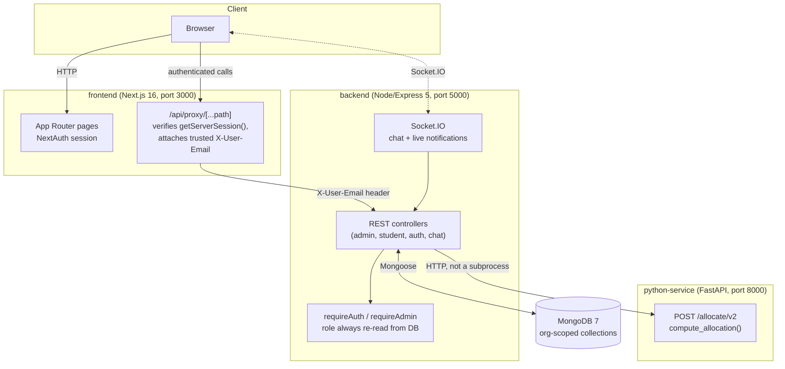

# Architecture

## System diagram

## Services

| Service | Responsibility |
|---|---|
| **frontend** | Next.js 16 App Router. Renders every page (landing, login, register, student/admin dashboards). One generic authenticated proxy route (`/api/proxy/[...path]`) verifies the real NextAuth session server-side via `getServerSession()` and attaches a trusted `X-User-Email` header — a client can never spoof another user's identity by editing a request body or query string, because the identity is derived server-side, not read from anything the client sent. |
| **backend** | The system of record. Owns MongoDB, authentication (`routes/auth.js`: `sync-user`, `register-organization`), and every REST endpoint under `/api/admin`, `/api/student`, `/api/chat`. `requireAuth` middleware looks up the real `User` document from the trusted email and attaches `req.currentUser` (including `role`, always fresh from the DB — never a header or client value); `requireAdmin` gates on that. Also runs Socket.IO for room chat and live allocation notifications. |
| **python-service** | A genuinely separate microservice (`backend/main.py`, FastAPI), called over real HTTP (`POST /allocate/v2`) — not a spawned subprocess. Stateless and DB-free: it receives the full profile list + room-template config in the request body and returns the computed allocation; it never talks to MongoDB itself. Wraps `ml_engine/executor.py`'s `compute_allocation()`. |
| **MongoDB** | The shared database. Every collection carries an `organizationId`, so a single physical database serves every tenant without any tenant seeing another's rows (see [Data model](#data-model) below). |

## Data model

Eight collections, every one carrying `organizationId: ObjectId` (`ref: 'Organization'`):

| Collection | Purpose |
|---|---|
| `Organization` | One document per tenant institution: `name`, `slug` (unique), `allowedEmailDomains` (**unique multikey index** — no two orgs can claim the same domain, enforced by MongoDB itself, not just app logic). |
| `User` | Login identity. `email` (globally unique — one person, one org, resolved by email domain), `role` (`STUDENT`/`ADMIN`, written only at account creation or by the founding-admin org-registration flow — never by a login request). |
| `Profile` | The questionnaire response: lifestyle/personality fields the allocation engine scores, plus structured preferences (`preferred_room_size`, `accessibility_need`). |
| `HostelConfiguration` | An admin's room-template inventory (capacity tiers, counts, floor). Multiple configs can be simultaneously active per org (e.g. a Male-wing config and a Female-wing config) — deliberately not mutually exclusive. |
| `RoomAllocation` | One document per formed room: `members`, `compatibility_score`, `room_number`/`block`/`floor`, lock status, and per-student preference-satisfaction tracking. |
| `ChangeRequest` | A student's room-change/accommodation request — `GENERAL` (free-text, admin reviews and manually swaps) or `ACCESSIBILITY` (structured; the admin UI surfaces actual eligible rooms to move the student into). |
| `Chat` | Per-room messages between roommates. |
| `Notification` | Persisted allocation notifications, for a student who was offline when they were placed. |

Tenant context is resolved **once, at login** (`routes/auth.js`'s `sync-user`, via
`Organization.findOne({ allowedEmailDomains: emailDomain })`) and stamped onto the
`User` document; every subsequent request trusts that stored `organizationId` rather
than re-resolving it, and every controller query is scoped by it.

## Allocation engine

### The pipeline

`triggerAllocation` (Node) → `POST /allocate/v2` (FastAPI) →
`ml_engine/executor.py`'s `compute_allocation()` → `ml_engine/matcher_greedy.py`'s
greedy + local-search matcher, using `ml_engine/encoder.py` for both compatibility
scoring and hard-conflict detection.

### Hard constraints are pre-filters, not scored features

Gender and smoking/drinking incompatibility never enter the cosine-similarity feature
vector (`encoder.py`'s `WEIGHTS` — no `smoking_habit`/`drinking_habit` entries).
Instead, `has_hard_conflict(p1, p2)` returns `True` for any incompatible pair
unconditionally, and that pair's cell in the similarity matrix is poisoned to `-9999.0`
— every downstream step (greedy pair selection, candidate expansion, local search)
explicitly skips `-9999.0` pairs. Gender is enforced by construction: profiles are
bucketed by `(gender, branch, year_of_study)` before any matching runs, and
`_assert_single_gender_room()` refuses to emit a room that somehow ended up
mixed-gender, as defense-in-depth against a future bug reintroducing the possibility.

**Why pre-filter instead of a very negative weight?** A weight, however large, is still
just a number a sufficiently strong match on every *other* dimension could theoretically
outweigh. A pre-filter that removes the pairing from consideration entirely can't be
outweighed by anything — which is the actual product requirement ("must NEVER be
violated"), not "should almost never happen."

### Two-phase: optimize, then guarantee

- **Phase 1 (optimize).** The existing greedy + local-search compatibility maximizer,
  constrained by the gender bucketing and hard-conflict poisoning above. Whatever it
  can't cleanly place is left for Phase 2 — Phase 1 never force-fits a low-quality or
  conflicting group just to avoid leftovers.
- **Phase 2 (guarantee, best-effort).** For every student Phase 1 didn't place: first
  try slotting them into an existing under-capacity room with zero hard-conflict against
  its current occupants (best-compatibility candidate among valid options); failing
  that, open a new room from whatever template capacity was never claimed. Capacity is
  never invented — only what the config already provisioned.
- **`needsManualPlacement`, not silent failure.** Anyone still unplaced after both
  phases is reported explicitly, with the specific blocking constraint named (e.g.
  `hard_conflict`, scoped to compare only against others of their own gender). A
  `capacityShortfall` pre-flight check rejects the whole run *before* matching starts if
  the configured bed count is simply less than the student count — no amount of
  clever placement fixes "you configured 90 beds for 116 students," so the system says
  so up front instead of attempting a run that's mathematically guaranteed to fail.

**Why not force a placement no matter what, or reject the whole run on any leftover?**
Both were considered and rejected. Forcing a placement (e.g. an overflow room bypassing
hard constraints) would violate the one property that must never be violated. Rejecting
the entire run over one or two edge-case students would deny 100+ students an
allocation over a problem affecting almost none of them. Reporting the specific,
genuinely-stuck students with a named reason lets an admin resolve the actual edge case
manually, while everyone else is placed normally — in practice, on real data, this list
is empty; it exists for the honest edge case, not as the common path.

### Soft preferences: room size and accessibility

`preferred_room_size` and `accessibility_need` are both best-effort, never
placement-blocking. A preference pass runs *before* normal fill for the relevant
capacity tier, seeding groups only from students who explicitly want that outcome
(ranked by pairwise compatibility) and drawing on "no preference" students purely as
flexible filler for any leftover slots — never as seeds, so a no-preference student can
never crowd out someone with an actual stated preference. Whatever the preference pass
can't satisfy falls through unchanged to the existing fill logic, then Phase 2 — so a
stated preference is genuinely free to try for, with zero risk to placement. Room-floor
data only exists in the Node layer (set by the admin per template, not something the
Python engine has ever known about), so accessibility floor-matching happens at
room-assignment time in `adminController.js`, not inside the Python matcher itself —
a deliberate split, not an oversight (see [docs/decisions.md](decisions.md)).
