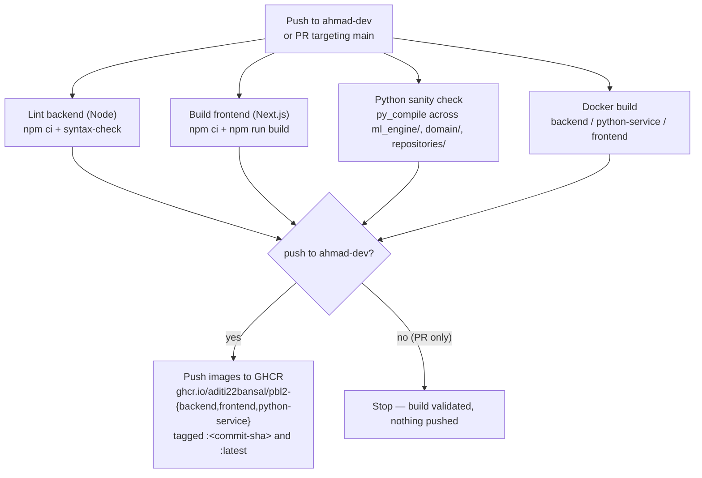

# CI/CD Pipeline

GitHub Actions workflow at [`.github/workflows/ci.yml`](../.github/workflows/ci.yml).
Triggers on every push to `ahmad-dev` and on pull requests targeting `main`.

## Job shapes

| Job | What it proves | Needs a live DB? |
|---|---|---|
| `lint-backend` | Node dependency tree resolves; every backend `.js` file parses (`node --check`) — there's no real lint/build script in `backend/package.json` today | No |
| `lint-frontend` | The exact production build command already used in `frontend/Dockerfile` (`npm run build`) still succeeds | No |
| `python-check` | Every Python source file compiles (`python -m py_compile`) — there's no pytest/flake8 config anywhere in `backend/`, so this is a syntax sanity check, not a test suite | No |
| `docker-build` | All 3 Dockerfiles (`backend/Dockerfile`, `backend/Dockerfile.python`, `frontend/Dockerfile`) still build, via a 3-way matrix | No |
| `push-images` | Only runs on push to `ahmad-dev` (never on a PR); re-builds and pushes the 3 images to GHCR using the built-in `GITHUB_TOKEN` (`packages: write`) — no extra secrets needed | No |

## Where images end up

- `ghcr.io/aditi22bansal/pbl2-backend`
- `ghcr.io/aditi22bansal/pbl2-frontend`
- `ghcr.io/aditi22bansal/pbl2-python-service`

Each tagged with the triggering commit's SHA and `latest`.
