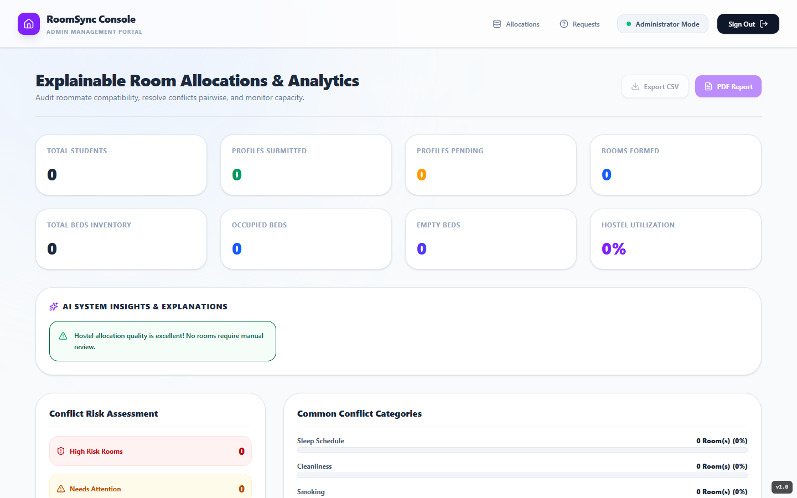
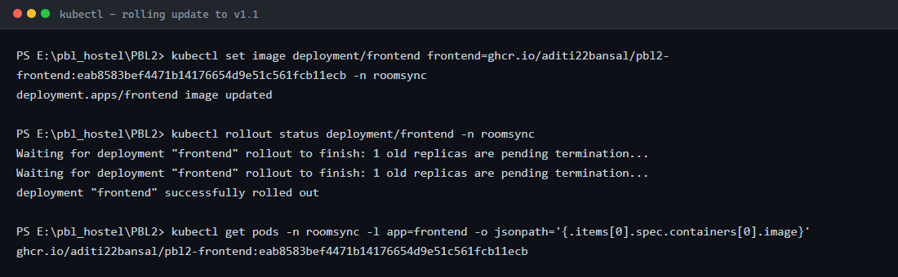
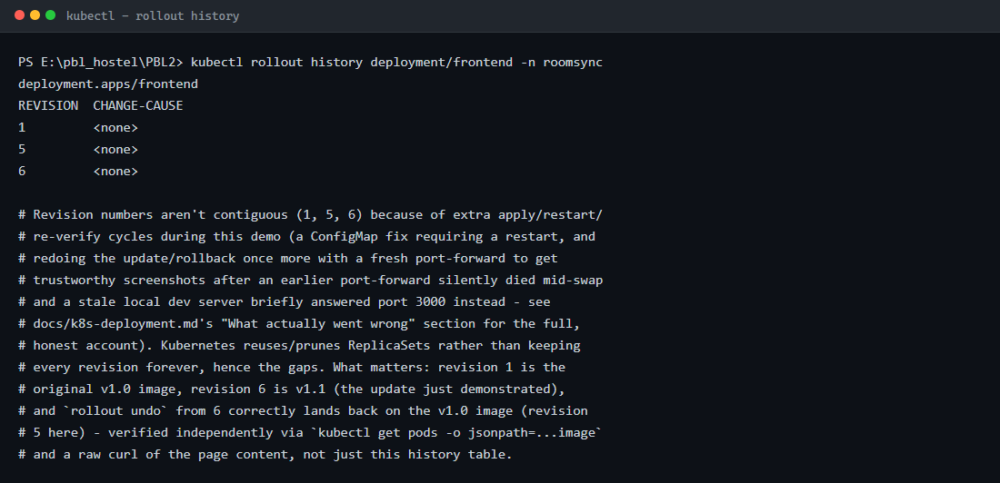
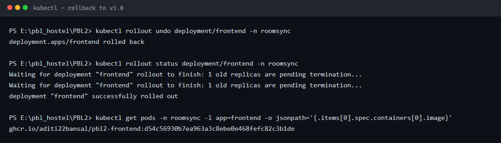

# Kubernetes Deployment

Manifests live in [`k8s/`](../k8s/) at the repo root. This doc covers what they deploy,
the real rolling-update/rollback demonstration performed against a live cluster, and the
actual commands used — for direct reuse in the reflection report.

## Cluster used

This was run against a local **kind** cluster (context `kind-devops-lab`, node
`devops-lab-control-plane`), not Docker Desktop's built-in Kubernetes — confirmed via
`kubectl config current-context` before starting. This matters for two manifest
decisions below (StorageClass, and why the demo uses `kubectl port-forward` instead of
the NodePort directly).

```
$ kubectl version
Client Version: v1.34.1
Server Version: v1.32.2

$ kubectl cluster-info
Kubernetes control plane is running at https://127.0.0.1:55264

$ kubectl get nodes
NAME                       STATUS   ROLES           AGE   VERSION
devops-lab-control-plane   Ready    control-plane   18d   v1.32.2

$ kubectl get storageclass
NAME                 PROVISIONER             RECLAIMPOLICY   VOLUMEBINDINGMODE      DEFAULT
standard (default)   rancher.io/local-path   Delete          WaitForFirstConsumer   true
```

`standard` (kind's `local-path-provisioner`) is what `k8s/mongo.yaml`'s PVC requests.

This cluster was shared with a few unrelated lab exercises (`apache-demo`,
`microservices-demo`, `mongo-lab`, `social-media`) at the time this demo was run — the
`roomsync` namespace and everything in it was fully isolated from those. Those 4
namespaces have since been removed in a later cleanup pass (coursework unrelated to
this project, no longer needed); the cluster now hosts only `roomsync` and
`monitoring` alongside its own built-in system namespaces.

## Manifests (`k8s/`)

| File | Contents |
|---|---|
| `namespace.yaml` | the `roomsync` namespace |
| `configmap.yaml` | non-secret shared env vars (`MONGO_URI`, `DEV_AUTH`, `PYTHON_SERVICE_URL`, `USE_REST_ALLOCATION`, `BACKEND_URL`, `NEXTAUTH_URL`) |
| `secret.yaml` | `NEXTAUTH_SECRET` — a clearly-marked placeholder, not a real secret (see the file's own comment for what a real deployment should do instead) |
| `mongo.yaml` | PersistentVolumeClaim (1Gi, `standard`) + Deployment + ClusterIP Service |
| `python-service.yaml` | Deployment + ClusterIP Service (internal only — backend is the only caller) |
| `backend.yaml` | Deployment + ClusterIP Service, readiness/liveness on `/api/health` |
| `frontend.yaml` | Deployment + **NodePort** Service, readiness/liveness on `/` |

Apply order (dependency order, not just alphabetical):

```
kubectl apply -f k8s/namespace.yaml
kubectl apply -f k8s/configmap.yaml -f k8s/secret.yaml
kubectl apply -f k8s/mongo.yaml
kubectl apply -f k8s/python-service.yaml
kubectl apply -f k8s/backend.yaml
kubectl apply -f k8s/frontend.yaml
```

### Why NodePort, not LoadBalancer

A bare local cluster (kind, or Docker Desktop's own K8s) has no cloud load-balancer
controller — a `LoadBalancer` Service just sits with `EXTERNAL-IP: <pending>` forever
without extra infrastructure (e.g. MetalLB). NodePort is the practical choice that
actually exposes something without needing that.

In practice, on *this specific* kind cluster, the NodePort range isn't published to the
host either — `docker ps` shows only the API server port (6443) mapped out. So the demo
below uses `kubectl port-forward` instead. NodePort is still the right manifest choice
for a cluster that *does* publish it (Docker Desktop's K8s does, by default).

### Two real bugs found while deploying (not before)

**1. A ConfigMap `PORT` collision broke the frontend.** The first version of
`configmap.yaml` included `PORT: "5000"` (for the backend) in the *shared* ConfigMap
that both `backend.yaml` and `frontend.yaml` consume via `envFrom`. That silently
injected `PORT=5000` into the frontend pod too, overriding the frontend image's own
baked-in `PORT=3000` default (set in `frontend/Dockerfile`) — Next.js dutifully started
on port 5000 while the Service/probes still expected 3000, so the pod never went
Ready (`CrashLoopBackOff`-adjacent: liveness kept killing it). Fixed by removing `PORT`
from the shared ConfigMap and setting it directly in `backend.yaml`'s own `env:` block
instead, scoped to just that Deployment.

**2. `kubectl port-forward svc/<name>` does not survive its target pod being replaced.**
During the first rolling-update attempt, the forward silently died the moment the old
pod was torn down (`error: lost connection to pod`), and — because a stale local
`npm run dev` process from an earlier, unrelated task happened to still be alive and
grabbed the now-free port 3000 the instant the tunnel released it — the *next* browser
check kept returning HTTP 200 with plausible-looking content, just from the wrong
source entirely (the old file on disk, not the cluster). This was only caught by
independently confirming server content two ways at once — a raw `curl` of the HTML
(bypassing the browser) *and* `kubectl get pods -o jsonpath=...image` via the API
server directly (unaffected by port-forward health) — and finding them disagree with
what the browser had just shown. The fix applied for the rest of this demo: kill and
restart the port-forward fresh after every `set image` / `rollout undo`, and check the
raw HTTP response before ever trusting a browser screenshot. This is the reason the
commands below explicitly re-forward the port between phases, and why every
"badge" screenshot is paired with a raw HTTP check in the actual session.

## Live demonstration

### 1. Deploy v1.0, confirm it's genuinely serving traffic

A tiny version badge was added to `frontend/src/app/layout.tsx` (bottom-right corner,
visible on every page) purely so a redeploy is visually obvious. `v1.0` was committed,
pushed, and built into a real image by the CI pipeline
(`ghcr.io/aditi22bansal/pbl2-frontend:d54c56930b7ea963a3c8ebe0e468fefc82c3b1de` — CI run
[33968408160](https://github.com/Aditi22Bansal/PBL2/actions/runs/33968408160), green).
All 4 manifests were applied with that SHA baked in, and every pod reached
`1/1 Running`:

```
NAME                              READY   STATUS    RESTARTS   AGE
backend-...                       1/1     Running   0          ...
frontend-...                      1/1     Running   0          ...
mongo-...                         1/1     Running   ...        ...
python-service-...                1/1     Running   0          ...
```

Reached via `kubectl port-forward -n roomsync svc/frontend 3000:3000` +
`kubectl port-forward -n roomsync svc/backend 5000:5000` (the frontend image's
`NEXT_PUBLIC_API_URL` is baked at build time to `http://localhost:5000`, so the backend
needs forwarding too, to the same local port, for the browser's own client-side calls to
resolve). A minimal org + admin were seeded directly into the cluster's own fresh Mongo
(via `kubectl port-forward svc/mongo 27018:27017`) so a real login could be exercised.
Login succeeded, the dashboard loaded, and the badge read **v1.0**:



### 2. Bump to v1.1 via CI, trigger the rolling update

The badge was changed to `v1.1`, committed, and pushed — a second genuine CI run
([33968600367](https://github.com/Aditi22Bansal/PBL2/actions/runs/33968600367), green)
built and pushed `ghcr.io/aditi22bansal/pbl2-frontend:eab8583bef4471b14176654d9e51c561fcb11ecb`.

```
$ kubectl set image deployment/frontend frontend=ghcr.io/aditi22bansal/pbl2-frontend:eab8583bef4471b14176654d9e51c561fcb11ecb -n roomsync
deployment.apps/frontend image updated

$ kubectl rollout status deployment/frontend -n roomsync
Waiting for deployment "frontend" rollout to finish: 1 old replicas are pending termination...
Waiting for deployment "frontend" rollout to finish: 1 old replicas are pending termination...
deployment "frontend" successfully rolled out
```



Port-forward re-established fresh (see the port-forward caveat above), and both the pod
image (via the API server) and a raw HTTP fetch of the page independently confirmed
`v1.1` before the browser was ever trusted:


### 3. Rollout history

```
$ kubectl rollout history deployment/frontend -n roomsync
deployment.apps/frontend
REVISION  CHANGE-CAUSE
1         <none>
5         <none>
6         <none>
```



(Revision numbers aren't contiguous — 1, 5, 6, not 1, 2, 3 — because of the extra
apply/restart/re-verify cycles from the two bugs above; Kubernetes reuses/prunes
ReplicaSets rather than keeping every intermediate revision. Revision 1 is the original
v1.0 image, revision 6 is v1.1.)

### 4. Rollback

```
$ kubectl rollout undo deployment/frontend -n roomsync
deployment.apps/frontend rolled back

$ kubectl rollout status deployment/frontend -n roomsync
Waiting for deployment "frontend" rollout to finish: 1 old replicas are pending termination...
Waiting for deployment "frontend" rollout to finish: 1 old replicas are pending termination...
deployment "frontend" successfully rolled out
```



Port-forward re-established fresh again, pod image and raw HTTP both independently
re-confirmed `v1.0` before the final screenshot:


## Final state

All 4 pods `1/1 Running`, frontend back on the v1.0 image
(`d54c56930b7ea963a3c8ebe0e468fefc82c3b1de`), confirmed via
`kubectl get pods -n roomsync -o wide` and `kubectl get all -n roomsync`. Real SIT Pune
data was never touched by any of this — the cluster's Mongo is a completely separate,
freshly-seeded instance with just the one demo org.
